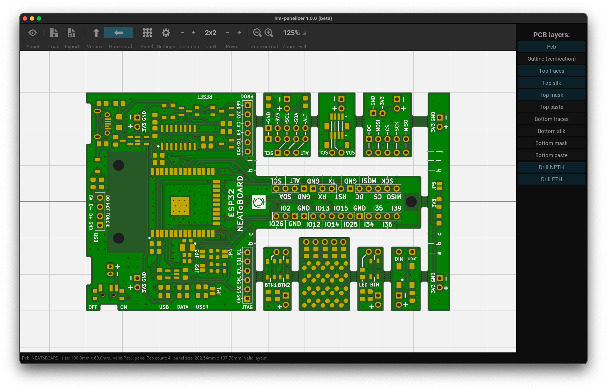
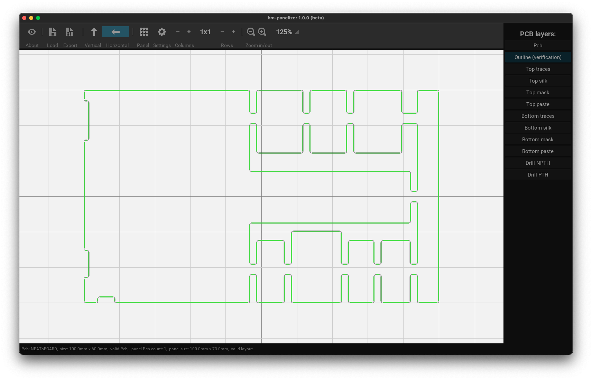
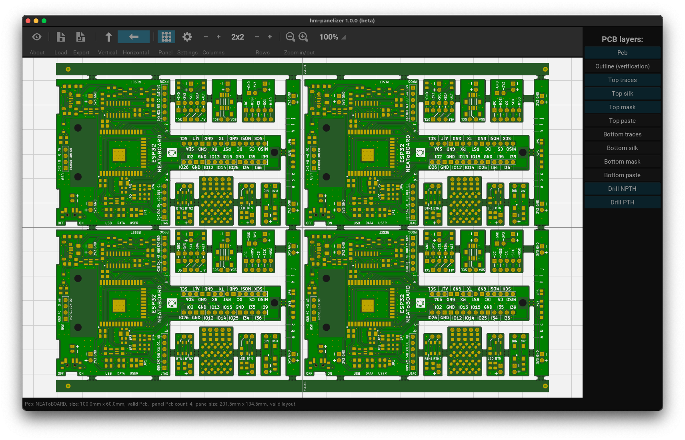
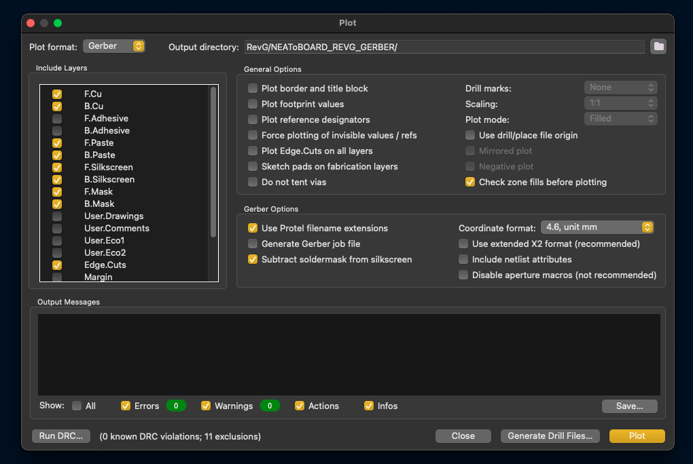
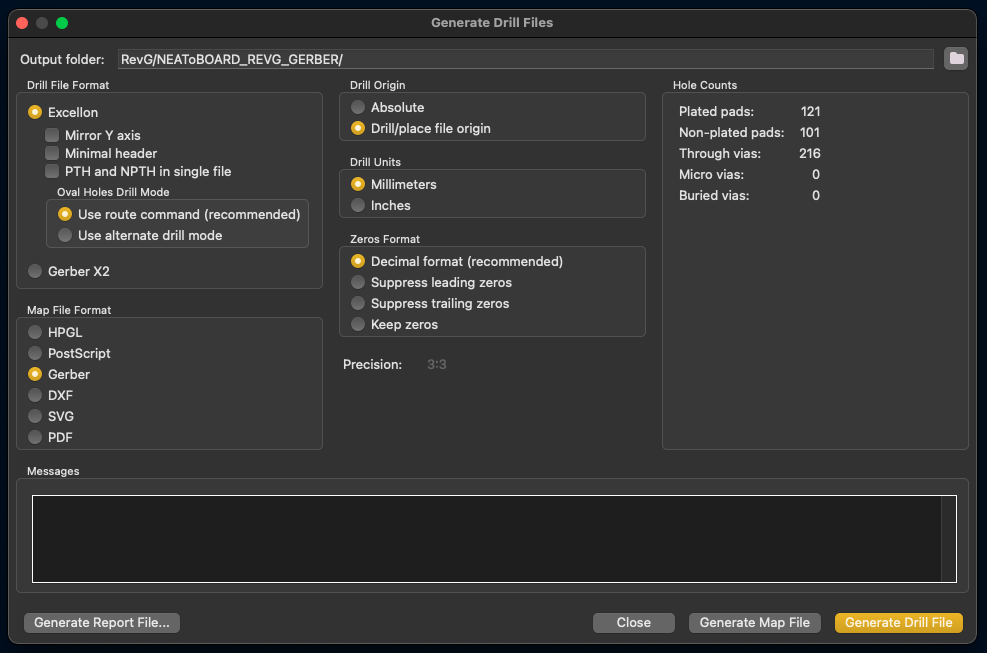

# hm-panelizer

A GUI based PCB gerber file viewer and panelizer written in python

This tool would not have been possible without the following projects:

- www.kivy.org

- www.github.com/curtacircuitos/pcb-tools

- www.github.com/opiopan/pcb-tools-extension

- www.useiconic.com/open

hm-panelizer is released under MIT license, Copyright 2021,2022 HalfMarble LLC (www.halfmarble.com)

Please note that I forked **_pcb-tools_** and **_pcb-tools-extension_**, made significant modifications,
and included them as part of this tool.

## Why did I create hm-panelizer?

There are a couple of open source tools out there that will help you panelize your Pcb, 
for example http://blog.thisisnotrocketscience.nl/projects/pcb-panelizer/ and www.github.com/yaqwsx/KiKit,
however, I wanted a GUI based app, which I could run (_easily_) on a macOS based machine, so here we are.

It also gave me an opportunity to learn python (_it is my first python app, so it is most certainly not optimally implemented_) 
and gain some insight into the mysterious world of gerber files.

## _! WARNING !_

_I hope that you will find hm-panelizer useful, however, I offer no guarantee that it will work in your case - 
always verify with other tools, before you order your Pcb panels!_

## How to run

hm-panelizer is a **_python app_**, so you will need **_python_** version `3.6.x` or higher (we use `3.9.12`) and 
install `pygame` and `pycairo` python packages. Here is an example of steps I had to perform on my own macOS machine:

- Install home-brew:

      /bin/bash -c "$(curl -fsSL https://raw.githubusercontent.com/Homebrew/install/HEAD/install.sh)"

- Add "/opt/homebrew/bin" to your PATH in ZSH configuration file:

      open -e ~/.zshrc

      export PATH=/opt/homebrew/bin:$PATH

- Install "pkg-config" and "cairo":

      /opt/homebrew/bin/brew install pkg-config

      /opt/homebrew/bin/brew install cairo

- Upgrade pip:

      python3 -m pip install --upgrade pip

- Install "pycairo" and "pygame" python packages:

      pip3 install pygame

      pip3 install pycairo

Once you have `python` and the required python packages installed, you can run `hm-panelizer` via command line
(i.e. terminal) by `cd`'ing into the **hm-panelizer** folder, then issuing `python3 main.py` command.

## Screenshots:

Main view

Main view (outline verification)

Panel view

## Will hm-panelizer work with my Pcb?

It might. The gerber viewer part should almost certainly work, but the panelizer feature is another story.

I personally use [KiCad](https://www.kicad.org) 6.x and wanted to panelize my own Pcb,
so that's what I mostly tested. I did try a few other Pcbs created with other software and I am eager to hear your
experience.

Please keep in mind, however, that hm-panelizer was just a side project for me. I am releasing it
as open source in hopes that the community will contribute to it.  If you find a bug and can fix it, then please help!

Having said that, here are requirements to create a Pcb that should make it suitable for hm-panelizer:

- use **metric system**
- your pcb gerber files must use **Altium/Protel filename extensions** (see https://pcbprime.com/pcb-tips/accepted-file-formats/Gerber%20File%20Extension%20Comparison.pdf)
- the **board outline gerber file** (.gm1) must be present
- **"Disable aperture macros"** when exporting gerber files (this may not be needed for simple designs and only needed by some Pcb houses)

Limitations:

- currently, the tool can only add **mouse-bites to perfectly straight lines** only (see hm-panelizer's "Outline verification" feature)
- only horizontal mousebites are suppported
- the **_horizontal/vertical_** feature is currently problematic with most Pcb houses (I recommend that you use your Pcb design app
to do the rotation and only use **hm-panelizer** for layout and mousebites for now)

Here are the KiCad settings I personally use to export my Pcbs:

KiCad plot settings

KiCad drill settings

## TODO

Here is a list of wish features that I personally would like to add when I have the time:

- speed optimizations (rendering and panelization)
- GUI for setting colors of Pcb layers, themes
- scrollbars
- support both horizontal and vertical mouse bites
- standard output/error redirected to the progress panel to track the debug logs
- render component parts
- 3D rendering

## Need help?

Visit my Discord channel https://discord.gg/7mf5qqBMEF

## Please consider supporting hm-panelizer if you want to see more features!

### https://ko-fi.com/halfmarble ### 

 